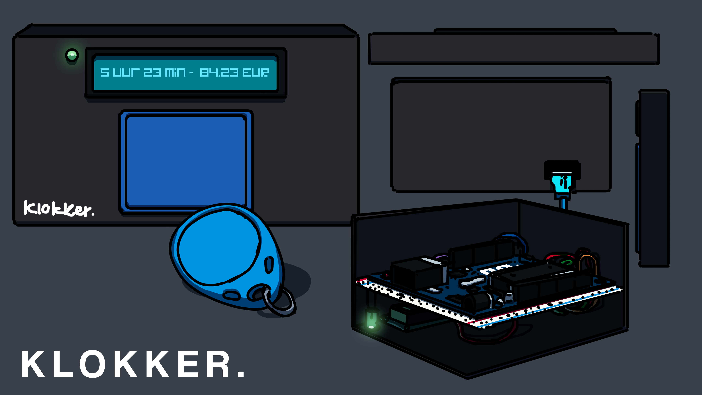
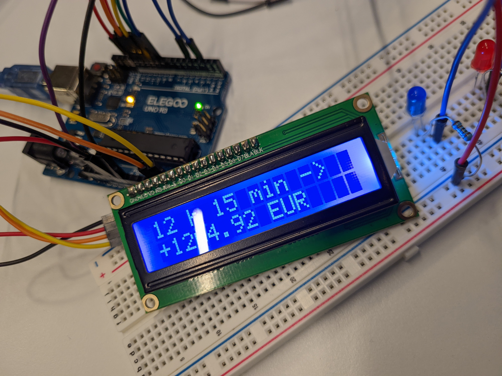
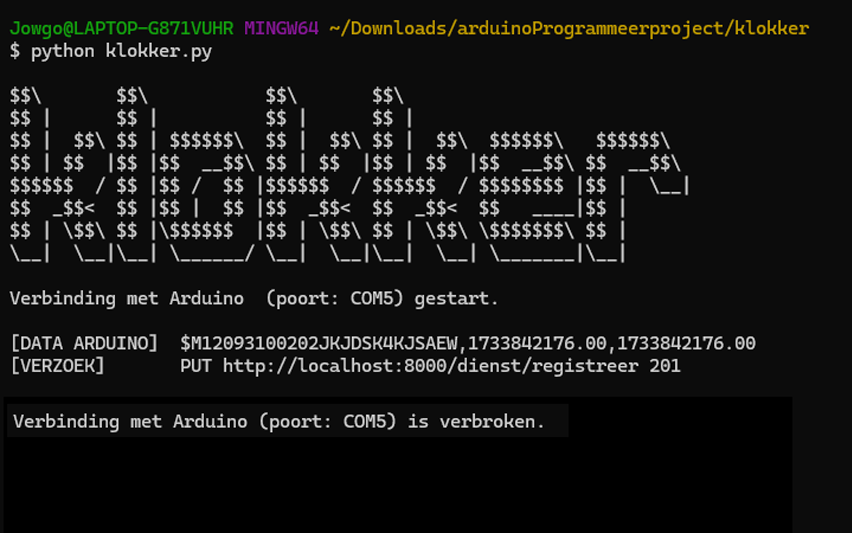
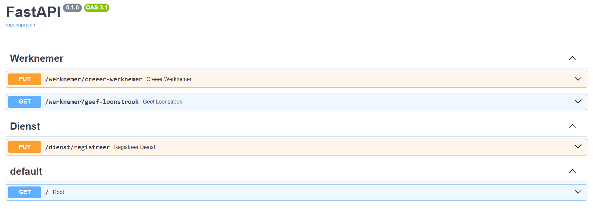

# **KLOKKER: de Simpele oplossing voor arbeidsuurregistratie in het mkb**

Midden- en kleinbedrijven (mkb'ers) vormen de ruggengraat van de Nederlandse economie. Toch kampen veel van deze bedrijven — zoals viskramen, fietsenmakers en dönerzaken — met een gemeenschappelijk probleem: het nauwkeurig bijhouden van arbeidsuren. Traditionele methoden zoals papieren notities of tools als Excel en Google Sheets blijken vaak foutgevoelig en kunnen zelfs misbruikt worden. Met Klokker is dat probleem verleden tijd.

### Wat is Klokker?
Klokker is een innovatief, gebruiksvriendelijk inkloksysteem dat speciaal is ontwikkeld voor mkb-bedrijven. Het systeem combineert een compact apparaatje met moderne technologie. Het metalen of plastic kastje bevat een ledlampje, een tagplatform en een lcd-scherm. Hiermee kunnen werknemers eenvoudig in- en uitklokken, terwijl het scherm duidelijke feedback geeft, zoals:
`5 uur 23 min -> €84,23` verdiend.

Daarnaast communiceert Klokker moeiteloos met een PostgreSQL-database via een server, zodat werkgevers altijd toegang hebben tot real-time data over arbeidsuren en loonkosten.

### Voor wie is Klokker geschikt?
Klokker is ontworpen met het mkb in gedachten. Het is ideaal voor bedrijven met een gevarieerd personeelsbestand, zoals studenten met een bijbaan, horecamedewerkers en winkelpersoneel. Voor werkgevers biedt Klokker niet alleen overzicht, maar ook vertrouwen in de nauwkeurigheid van de gegevens.

### Waarom kiezen voor Klokker?
Klokker onderscheidt zich van andere inkloksystemen door zijn eenvoud en slimme functies. Het systeem biedt:

- Directe feedback: het lcd-scherm laat werknemers meteen zien of hun uren zijn geregistreerd.
- Automatische aanpassingen: het systeem houdt rekening met feestdagen, toeslagen voor avonduren en het type functie van de werknemer (bijvoorbeeld manager of schoonmaker).
Betrouwbare gegevensopslag: alle data wordt veilig opgeslagen in een PostgreSQL-database, toegankelijk voor werkgevers wanneer nodig.

Met Klokker kies je voor transparantie, efficiëntie en eenvoud. De arbeidsurenregistratie was nog nooit zo makkelijk!

# Terugkoppeling coderecensie
<naam1, naam2>

### Probleem 1
De led-fading gebruikt een for-loop met delay — wat blokkerend werkt en de prestaties van de applicatie negatief beïnvloedt. De oplossing hiervoor zou het gebruik van niet-blokkerende timers met `millis()` in plaats van `delay()`. Deze aanpak maakt de led-fading efficiënter en voorkomt blokkering — maar maakt de code complexer.

### Probleem 2
Overmatig gebruik: globale variabelen zoals `tag_id` en `werknemers` verhogen de kans op onverwachte bijwerkingen en maken debugging moeilijker. Het gebruik van lokale variabelen en parameters kan de scope van deze gegeven eventueel beperken. Het is alleen zo dat het gebruik van globale variable Arduino-eigen is: `.ino`-bestanden staan geen `main`-functie toe — louter de ingangfuncties `setup` en `loop`. Het creëren van variable die meerdere lussen mee moeten gaan, omdat op hen gebouwd moet worden, is daarom eigenlijk alleen mogelijk met deze globale variabelen. Om dit globalevariableprobleem op te lossen, zou het hele programma herschreven moeten worden in C++ met de `avr/io.h`.

### Probleem 3
Het gebruik van`String.h`: `Strings` gebruiken veel meer werkgeheugen dan `const char*`. Juist op Arduino's is de hoeveelheid werkgeheugen beperkt. Het zou daarom verstandiger zijn om de `Strings` te vervangen. Dit voorstel lijkt deugzaam, maar ziet de variabele aard van de uitvoer van het Python-programma over het hoofd. Dit programma geeft strings terug van diverse lengte en het is onmogelijk voor de Arduino om te weten hoe lang deze zullen zijn. `String.h` wordt om deze reden dus terecht gebruikt. Zou `const char*` of `char string[]' worden gebruikt, dan zouden deze moeten beschikken over een vrij grote buffer voor de onbekende hoeveelheid karakters — wat in principe weer neerkomt op een `String`.  

### Probleem 4
De gehardcode limiet werknemers (`Werknemer werknemers[10];`): het aantal werknemers dat zou kunnen inklokken is hierdoor beperkt tot de waarde die staat gehardcoded in de broncode (het `.ino`-bestand). Hoewel deze feedback hout snijdt, is het niet zou makkelijk als het lijkt om een alternatief te implementeren: tijdens de productie van het product is reeds gepoogd C++'s `std::vector` te gebruiken, maar Arduino ondersteunt deze headerbestanden niet. Het is ook om deze reden dat Arduino `String.h` gebruikt in plaats van C++'s _'echte'_ `<string.h>`. Wederom zou het programmeren herschreven moeten worden in C++ in plaats van de huidige Arduino-abractietaal.

# Screencast (videouitleg project)
_Let op_: het is niet gelukt de zesminutenlimiet te volgen (9 min 21 s). Hieraan ligt ten grondslag dat dit project in feite twee projecten is: een functionerend Arduino-inkloksysteem met een volledig functionerende FastAPI-server als backend. Ondanks het feit dat de video is versneld, was het onmogelijk iedere eigenschap voldoende aan het licht te brengen. In de opdrachtbeschrijving zelf staat immers: _"Always show all features: anything that’s not in the video does not exist."_ Gelieve begrip te hebben voor de omvang van dit project ten aanzien van de opgelegde tijdlimiet.

# Dankbetuiging

